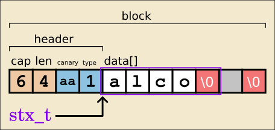

# Stricks
Experimental managed C-strings library.  
 
  
:orange_book: [API](#API)

## Why ?

C strings are hard, unassisted and risky.  
Appending while keeping track of length, null-termination, realloc, etc...  

They can also be slowed by excessive (sometimes implicit) calls to `strlen`.  

Say you're making a forum engine, where a *page* is a fixed buffer.  
How to safely add posts without truncation ?


### The long way

```C
char page[PAGE_SZ];

// Keep track
size_t page_len = 0;

while(1) {

    char* user = db("user");
    char* text = db("text");

    // Will null be counted ? Lookup `snprintf`...
    // No it won't
    int post_len = snprintf (
        // Keep track
        page + page_len,
        // Will it be null-terminated ? Lookup `snprintf`...
        // Yes it will
        PAGE_SZ - page_len, 
        "<div>%s<br>%s</div>", user, text
    );
    
    // Don't forget that '+1'
    if (page_len + post_len + 1 > PAGE_SZ) {
        page[page_len] = 0;
        break;
    }
    
    // Keep track
    page_len += post_len;
}
```

### The stricky way

```C
stx_t page = stx_new(PAGE_SZ);

while(1) {

    char* user = db("user");
    char* text = db("text");

    if (stx_catf(page, "<div>%s<br>%s</div>", user, text) <= 0) 
        break;
}
```

### Quick sample

See *example/forum.c* for a Stricks implementation of the 'forum'.  

`make && cd example && ./forum`


# Principle



The `stx_t` (or "*strick*") type is just a normal `char*` string.  

```C
typedef char* stx_t;
```

The trick :wink: lies **before** the *stx_t* address :  

```C
Header {   
         cap;  
         len;  
         cookie; 
         flags;
    char data[];
}
```

*Header* takes care of the string state and bounds-checking.  
The `stx_t` type points directly to the `data` member.  

This technique is used notably in antirez [SDS](https://github.com/antirez/sds).  

Header and data occupy a **single block** of memory (an "*SBlock*"),  
avoiding the further indirection you find in typical `{len,*str}` schemes.    

The *SBlock* is invisible to the user, who only passes `stx_t` to and from the API.    
Of course, being really a `char*`, a *strick* can be passed to any  
(non-modifying) `<string.h>` function.  

The above Header layout is simplified. In reality, Stricks defines several header types to optimize space for short strings, and houses the *cookie* and *flags* attributes in a separate `struct`.

#### example usage
```C
stx_t s = stx_from("Stricks", 0);

stx_cata(s, " rule!");        
printf("%s\n", s);

//> Stricks rule!

```


# Security

Stricks aims at not letting memory faults happen through the API.  
All methods check for a valid *Header*.  
If not valid, no action is taken and a *falsy* value gets returned.  

(See *[stx_free](#stx_free)*)


# API

[stx_new](#stx_new)  
[stx_from](#stx_from)  
[stx_dup](#stx_dup)  

[stx_cap](#stx_cap)  
[stx_len](#stx_len)  
[stx_spc](#stx_spc)  

[stx_free](#stx_free)  
[stx_reset](#stx_reset)  
[stx_trim](#stx_trim)  
[stx_show](#stx_show)  
[stx_resize](#stx_resize)  
[stx_check](#stx_check)  
[stx_equal](#stx_equal)  
[stx_split](#stx_split)  

[stx_append](#stx_append) / stx_cat  
[stx_append_count](#stx_append_count) / stx_ncat  
[stx_append_format](#stx_append_format) / stx_catf  
[stx_append_alloc](#stx_append_alloc) / stx_cata  
[stx_append_count_alloc](#stx_append_count_alloc) / stx_ncata  


Custom allocator and destructor can be defined with  
```
#define STX_MALLOC ...
#define STX_FREE ...
```

### stx_new
Allocates and inits a new *strick* of capacity `cap`.  
```C
stx_t stx_new (const size_t cap)
```

### stx_from
Creates a new *strick* with at most `n` bytes from `src`.  
```C
stx_t stx_from (const char* src, const size_t n)
```
If `n` is zero, `strlen(src)` is used.  
Capacity gets trimmed down to length.

```C
stx_t s = stx_from("Stricks", 0);
stx_show(s); 
// cap:7 len:7 data:'Stricks'

```

### stx_dup
Creates a duplicate strick of `src`.  
```C
stx_t stx_dup (const stx_t src)
```
Capacity gets trimmed down to length.

```C
stx_t s = stx_new(16);
stx_cat(s, "foo");
stx_t dup = stx_dup(s);
stx_show(dup); 
// cap:3 len:3 data:'foo'

```


### stx_cap  
Current capacity accessor.
```C
size_t stx_cap (const stx_t s)
```

### stx_len  
Current length accessor.
```C
size_t stx_len (const stx_t s)
```

### stx_spc  
Remaining space.
```C
size_t stx_spc (const stx_t s)
```


### stx_reset    
Sets data length to zero.  
```C
void stx_reset (const stx_t s)
```
```C
stx_t s = stx_new(16);
stx_cat(s, "foo");
stx_reset(s);
stx_show(s); 
// cap:16 len:0 data:''
```

### stx_free
```C
void stx_free (stx_t s)
```
Releases the enclosing SBlock.  

:cake: **Security** : Once the SBlock is freed, **no use-after-free or double-free** should be possible through the Strick API :  

```C
stx_t s = stx_new(16);
stx_append(s, "foo");
stx_free(s);

// Use-after-free
stx_append(s, "bar");
// No action. Returns 0.  
printf("%zu\n", stx_len(s));
// 0

// Double-free
stx_free(s);
// No action.
```

#### How it works :wrench:
On first call, `stx_free(s)` zeroes-out the header, erasing the `cookie` canary.  
All subsequent API calls check for the canary, find it dead, then do nothing.


### stx_resize    
Change capacity.  
```C
bool stx_resize (stx_t *pstx, const size_t newcap)
```
* If increased, the passed **reference** may get transparently updated.
* If lowered below length, data gets truncated.  

Returns: `true/false` on success/failure.
```C
stx_t s = stx_new(3);
int rc = stx_cat(s, "foobar"); // -> -6
if (rc<0) stx_resize(&s, -rc);
stx_cat(s, "foobar");
stx_show(s); 
// cap:6 len:6 data:'foobar'
```


### stx_trim
Removes white space, left and right.
```C
void stx_trim (const stx_t s)
```
Capacity remains the same.


### stx_split
Splits a *strick* **or** string on separator `sep` into an array of *stricks*. 
```C
stx_t* stx_split (const void* s, const char* sep, unsigned int *outcnt)
```
`*outcnt` receives the returned array length.

```C
stx_t s = stx_from("foo, bar", 0);
unsigned cnt = 0;

stx_t* list = stx_split(s, ", ", &cnt);

for (int i = 0; i < cnt; ++i) {
    stx_show(list[i]);
}

// cap:3 len:3 data:'foo'
// cap:3 len:3 data:'bar'

```


### stx_equal    
Compares `a` and `b`'s data string.  
```C
bool stx_equal (const stx_t a, const stx_t b)
```
* Capacities are not compared.
* Faster than `memcmp` since stored lengths are compared first.


### stx_show    
```C
void stx_show (const stx_t s)
```
Utility. Prints the state of `s`.
```C
stx_show(foo);
// cap:8 len:5 data:'hello'
```


### stx_check    
```C
bool stx_check (const stx_t s)
```
Check if *s* has a valid header.  


### stx_append
stx_cat  
```C
int stx_append (stx_t dst, const char* src)
```
Appends `src` to `dst`.  
* **No reallocation**.
* Nothing done if input exceeds remaining space.

Return code :  
* `rc >= 0`  on success, as change in length.  
* `rc < 0`   on potential truncation, as needed capacity. 
* `rc = 0`   on error.  

```C
stx_t s = stx_new(5);  
stx_cat(s, "abc"); //-> 3
printf("%s", s); // "abc"  
stx_cat(s, "def"); //-> -6  (needs capacity = 6)
printf("%s", s); // "abc"
```


### stx_append_count
stx_ncat  
```C
int stx_ncat (stx_t dst, const char* src, size_t n)
```
Appends at most `n` bytes from `src` to `dst`.  
* **No reallocation**.
* if `n` is zero, `strlen(src)` is used.
* Nothing done if input exceeds remaining space.

Return code :  
* `rc >= 0`  on success, as change in length.  
* `rc < 0`   on potential truncation, as needed capacity.
* `rc = 0`   on error.  

```C
stx_t s = stx_new(5);  
stx_ncat(s, "abc", 2); //-> 2
printf("%s", s); // "ab"
```


### stx_append_format
stx_catf     
```C
int stx_catf (stx_t dst, const char* fmt, ...)
```
Appends a formatted c-string to `dst`, in place.  

* **No reallocation**.
* Nothing done if input exceeds remaining space.

Return code :  
* `rc >= 0`  on success, as increase in length.  
* `rc < 0`   on potential truncation, as needed capacity.  
* `rc = 0`   on error.  

```C
stx_t foo = stx_new(32);
stx_catf (foo, "%s has %d apples", "Mary", 10);
stx_show(foo);
// cap:32 len:18 data:'Mary has 10 apples'
```


### stx_append_alloc
stx_cata     
```C
size_t stx_cata (stx_t *pdst, const char* src)
```
Appends `src` to `*pdst`.

* If over capacity, `*pdst` gets **reallocated**.
* reallocation reserves 2x the needed memory.

Return code :  
* `rc = 0`   on error.  
* `rc >= 0`  on success, as change in length.  

```C
stx_t s = stx_new(3);  
stx_cat(s, "abc"); 
stx_cata(s, "def"); //-> 3 
stx_show(s); // "cap:12 len:6 data:'abcdef'"
```


### stx_append_count_alloc
stx_ncata     
```C
size_t stx_ncata (stx_t *pdst, const char* src, const size_t n)
```
Append `n` bytes of `src` to `*pdst`.

* If n is zero, `strlen(src)` is used.
* If over capacity, `*pdst` gets reallocated.

Return code :  
* `rc = 0`   on error.  
* `rc >= 0`  on success, as change in length. 


## Usage

```C
// app.c

#include <stdio.h>
#include "stx.h"

int main() {

    char name[] = "Alco";
    stx_t msg = stx_new(100);

    stx_catf(msg, "Hello! My name is %s.", name);
    puts(msg);

    return 0;
}
```

```
$ gcc app.c libstx -o app && ./app
Hello! My name is Alco.
```

## Build & unit-test

`make && make check`

## TODO
* utf8
* Slices / StringView
* More high-level methods